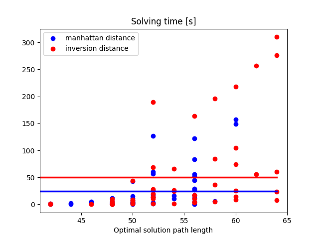
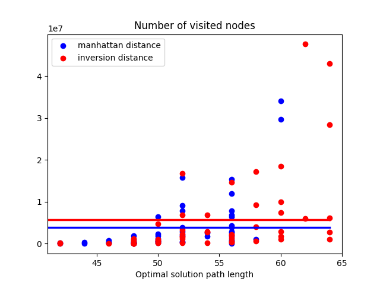

# Wprowadzenie do Sztucznej Intelignecji - lab 1

Jakub Musiał

 

## 1. Wprowadznie

* Zadanie - rozwiązać problem układanki [15 Puzzle](https://en.wikipedia.org/wiki/15_puzzle)

* Rozwiązanie - algorytm A* z uzyciem heurystyk:
  * Manhattan distance
  * Inversion distance

* Implementacja: C++

 
 

## 2. Czas rozwiązania

Poniższy wykres przedstawia czasy rozwiązania układanki względem długości rozwiązania oraz średnie czasy rozwiązań dla zadanych heurystyk. Można zauważyć, że haurystyka _manhattan distance_ zapewnia znacząco krótszy czas rozwiązania niż _inversion distance_.

 
 

## 3. Liczba odwiedzonych stanów

Czas wykonania programu jest w pewien sposób proporcjonalny do liczby odwiedzonych stanów. Widać to także na poniższym wykresie. Jednak w tej kategorii przewaga _manhattan distance_ nad _inversion distance_ przestaje być zauważalna.

Warto zwrócić uwagę na to, iż średnia liczba odwiedzonych stanów jest rzędu $< 10^7$, co jest zdecydowanie mniejszą wartością niż liczba wszytskich poprawnych permutacji, która wynosi $\frac{15!}{2} \approx 6 \cdot 10^{11}$.
