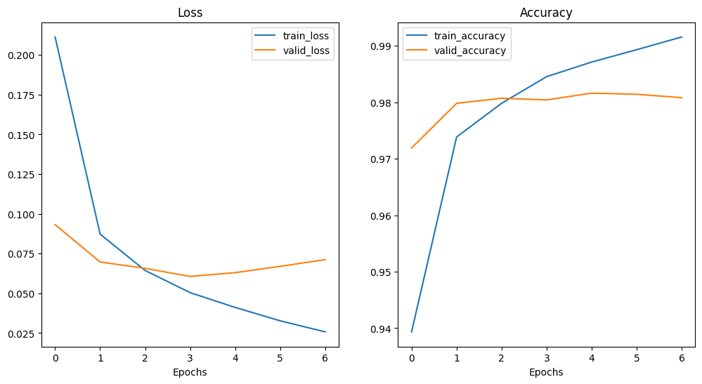

<script type="text/javascript"
  src="https://cdnjs.cloudflare.com/ajax/libs/mathjax/2.7.0/MathJax.js?config=TeX-AMS_CHTML">
</script>
<script type="text/x-mathjax-config">
  MathJax.Hub.Config({
    tex2jax: {
      inlineMath: [['$','$'], ['\\(','\\)']],
      processEscapes: true},
      jax: ["input/TeX","input/MathML","input/AsciiMath","output/CommonHTML"],
      extensions: ["tex2jax.js","mml2jax.js","asciimath2jax.js","MathMenu.js","MathZoom.js","AssistiveMML.js", "[Contrib]/a11y/accessibility-menu.js"],
      TeX: {
      extensions: ["AMSmath.js","AMSsymbols.js","noErrors.js","noUndefined.js"],
      equationNumbers: {
      autoNumber: "AMS"
      }
    }
  });
</script>

<div align="center">

# Wprowadzenie do Sztucznej Intelignecji - lab 3

Jakub Musiał

<div align="left">

<br />

## Zadania 1 - 2

### 1. Wprowadznie

* Zadanie: zaprojektować sieć neuronową rozpoznająca cyfry ze zbioru [MNIST](https://en.wikipedia.org/wiki/MNIST_database)

* Rozwiązanie: 5-warstwowa sieć konwolucyjna o strukturze:

    ```
    _________________________________________________________________
    Layer (type)                Output Shape              Param #   
    =================================================================
    conv2d (Conv2D)             (None, 28, 28, 10)        50        
                                                                    
    conv2d_1 (Conv2D)           (None, 28, 28, 10)        410       
                                                                    
    conv2d_2 (Conv2D)           (None, 28, 28, 10)        410       
                                                                    
    flatten (Flatten)           (None, 7840)              0         
                                                                    
    dense (Dense)               (None, 10)                78410     
                                                                    
    =================================================================
    Total params: 79,280
    Trainable params: 79,280
    Non-trainable params: 0
    _________________________________________________________________
    ```

    * 3 warstwy konwolucyjne o parametrach:
      * Liczba filtrów $= 10$
      * Rozmiar jądra $= 2$
      * Funkcja aktywacji - `relu`
      * Padding - `same` (konwolucja nie zmienia rozmiaru zdjęcia)
    * Wartwa spłaszczająca (Flatten layer)
    * Warstwa gęsta (wyjściowa) o $10$ neuronach

* Implementacja: Python

<br />

### 2. Trenowanie modelu

Model był trenowany używając parametrów:

* Funkcja straty - `SparseCategoricalCrossentropy`
* Optimizer - `Adam` z parametrem uczenia równym $0.001$
* Metryka - `SparseCategoricalAccuracy`
* Liczba epok $= 7$

Poniższy wykres przedstawia zmianę wartości funkcji straty oraz skuteczności predykcji modelu na zbiorach treningowym i testowym w zależności od epoki trenowania

<div align="center">



<div align="left">

<br />

### 3. Wyniki

Skuteczność modelu testowana była na 3 zbiorach:

| Lp. | Zbiór      | Liczba zdjęć | Opis | Skuteczność |
| :-: | :--------: | :----------: | :--: | :---------: |
| 1   | Treningowy | $60$ tys.    | Zdjęcia ze zbioru MNIST | $0.9938$ |
| 2   | Testowy    | $10$ tys.    | Zdjęcia ze zbioru MNIST | $0.9847$ |
| 3   | Własny     | $30$         | 3 zdjęcia każdej cyfry <br/> wygenerowane na tablecie graficznym | $0.7246$ |

Różnica między skutecznością dla zbioru testowego i zbioru własnego wynika z tego, że zdjęcia ze zbioru testowego pochodzą z tej samej bazy, co zdjęcia ze zbioru treningowego, zatem model dobrze wyuczył się rozpoznawać wzorce na takim typie zdjęć. Zdjęcia ze zbioru własnego były generowane ręcznie i nie były w żaden sposób przetwarzane, zatem mogą się na nich pojawiac wzorce, których model "nie widział" w trakcie uczenia.

<br />
<br />
<br />

## Zadanie 3

### Wprowadzenie

* Zadanie: zaimplementować algorytm propagacji wstecznej wraz z całą prostą sieć neuronową, która po otrzymaniu na wejści dwóch liczb z przedziału $[-1, 1] \setminus \{0\}$ zwróci $1$, gdy liczby mają ten sam znak oraz $0$, kiedy są one przeciwnego znaku

* Implementacja: Python

<br />

### Parametry modelu

Model trenowany był na losowo wygenerowanym zbiorze testowym o $50$ tysiącach par liczb. 

Skuteczność modelu testowana była po wytrenowaniu modelu dla każdej kombinacji z poniższej siatki parametrów:

* Funkcja aktywacji: `relu` oraz `sigmoid`
* Normalizacja danych: brak, `L1` oraz `L2`
* Współczynnik uczenia: $0.001$, $0.005$, $0.01$

Stałe parametry:

* Metryka: `accuracy` (skutezność)
* Funkcja straty: `MSE` (średni błąd kwadratowy)

Zbiór testowy składał się z $10$ tysięcy losowo wygenerowanych liczb

<br />

### Wyniki

Średnie wyniki modelu dla testowanych parametrów to:

* Strata: $0.4341$
* Skuteczność: $0.5659$

<br />

Najlepszy wynik testowany model uzyskał dla poniższych paramterów:

* Funkcja aktywacji: `relu`
* Normalizacja: `L1`
* Współczynnik uczenia: $0.01$

Uzyskany wynik to:

* Strata: $0.082$
* Skuteczność: $0.918$