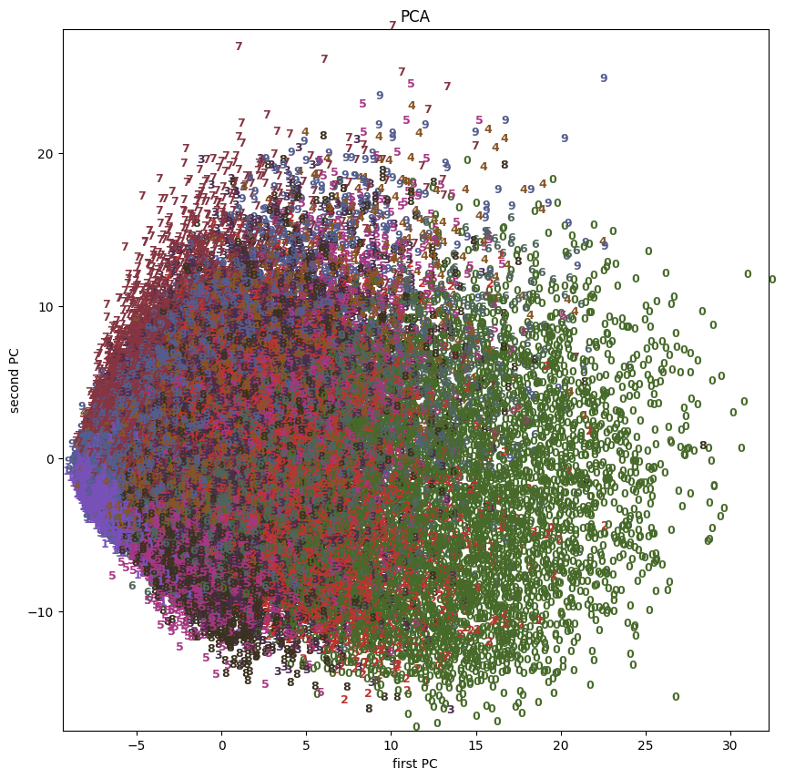
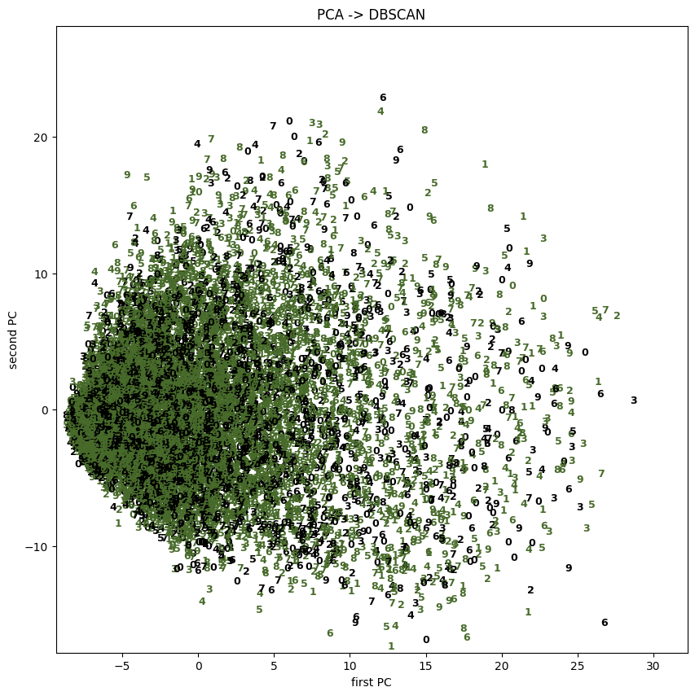
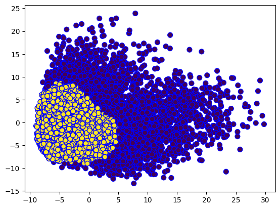

# Wprowadzenie do Sztucznej Intelignecji - lab 4

Jakub Musiał

 

## Zadanie 1

### 1. Wprowadznie

* Zadanie: wytrenowanie modelu lasu decyzyjnego rozpoznającego cyfry ze zbioru [MNIST](https://en.wikipedia.org/wiki/MNIST_database)

* Implementacja: Python

 

### 2. Trenowanie modelu

Model był trenowany używając parametrów:

* Liczba drzew $= 30$

* Metryka - `accuracy`

 

### 3. Wyniki

Skuteczność modelu na zbiorze testowym [MNIST](https://en.wikipedia.org/wiki/MNIST_database) - $0.9629$

 
 
 

## Zadanie 2

### 1. Wprowadznie

* Zadanie: implementacja modelu DBSCAN rozpoznającego cyfry ze zbioru [MNIST](https://en.wikipedia.org/wiki/MNIST_database)

* Implementacja: Python

 

### 2. Trenowanie modelu

Dane do treningu były przetworzone modelem PCA (Principle Component Analysis) - redukcja wymiaru polegająca na grupowainu po minimalnych i maksymalnych koordynatach najbardziej wysuniętych zaznaczonych punktów

Model był trenowany używając parametrów:

* $EPS = 3$ 

* $minPts = 1000$ 

> EPS - Promień określonych otoczeń. Jeśli odległość między dwoma punktami jest mniejsza lub równa ESP, zostaną one uznane za sąsiadów.
>
> minPts - Minimalna liczba punktów w danym otoczeniu, aby utworzyć klastry. 

 

### 3. Wyniki

* Liczba klastrów: $24$

* Skuteczność: $0.68$

* Zaszumienie: $0.07$

Poniże wykresy przedstawiaja wyniki modelu

 

 

